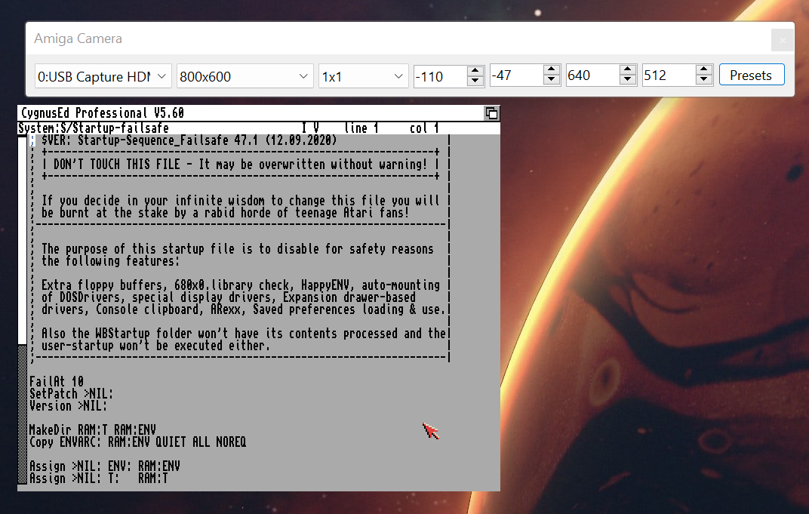
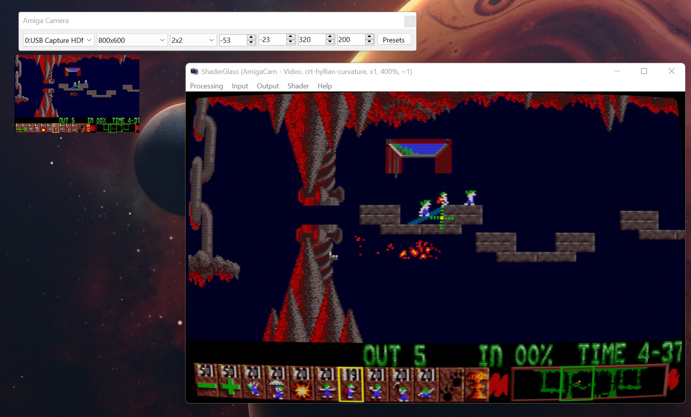
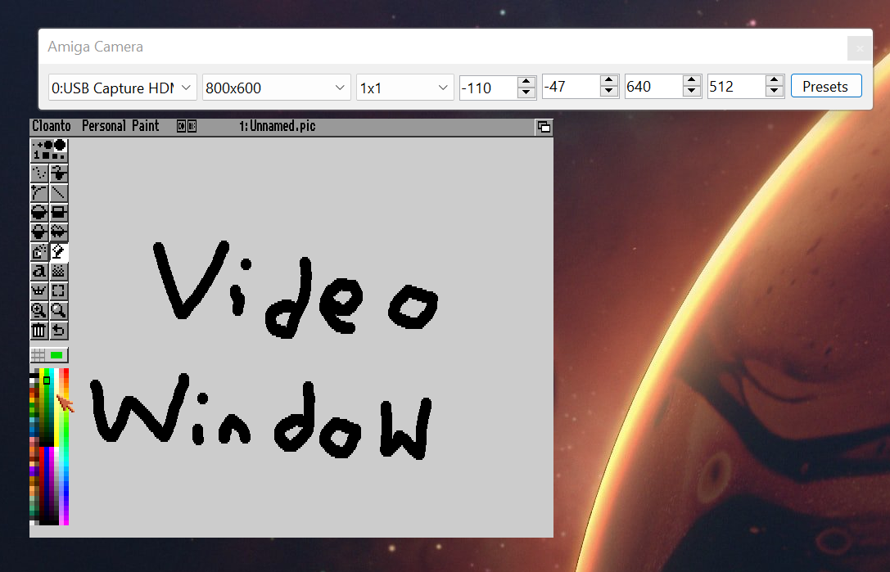

# AmigaCam

This is a Windows tool which is used with Video Capture devices and recording and streaming software. The video is presented within a Windows form, which can then be captured via Window Recording or Streaming software, to apply a secondary process of shaders, filters, etc. before the video is sent to a video stream or a video recording.

This tool came about due to the need of using upscaling shaders within the OBS software during Twitch Streams. It was found to be easier to use tools like [Shader Glass](https://mausimus.itch.io/shaderglass) to capture the Amiga video from an offscreen video, apply a shader and then have OBS capture the ShaderGlass window as the video source.

## Screenshots





## Usage

The tool is written in .NET and is for Windows. Due to the Library dependencies, this tool cannot be ported to Linux or MacOS. Simply unzip the AmigaCam archive to any folder, and run the AmigaCam executable. 



The program is split into two Windows; Controls and Video

### Controls Window

The Control window sets the capture device, capture resolution, original pixel size, crop settings and apply a preset.

From left to right the options are:

1. Set the Capture Device
2. Set the Capture Resolution (in Pixels)
3. Set the Source Pixel Size
4. Left Crop Coordinate
5. Top Crop Coordinate
6. Crop Width
7. Crop Height
8. Apply Preset or Reload Presets

#### Capture Device

The Capture Device is determined by the Windows OS and Drivers. These should be the same in any other Recording/Streaming software. 

The Resolution is Capture Resolution. In most cases, and certainty with the Amiga, the resolution will [not be the same](https://en.wikipedia.org/wiki/Overscan) as the game or application size.

#### Source Pixel Size

This sets the size of the pixel on the Video Stream. In some cases, such as the [Indivision series](http://wiki.icomp.de/wiki/Indivision) low resolutions will be upscaled by a factor of two. This is to compensate against that. 

#### Crop

The cropping options set the video crop, these are in pixels - and take pixel upscaling into account. The target video size will be the given width/height.

In most all cases on the Amiga, games and software will require some form of cropping to adjust for overscan. It should be noted that some games are not strictly 320x200; Games like The Settlers draw into the overscan area, whilst other games such as James Pond or the Settlers will have a reduced size for performance or PAL/NTSC reasons.

#### Presets

The preset button provides a drop down to apply a saved preset. These are in the Presets.txt file which should be in the same directory as the executable.

The preset file contains the name of the preset, cropping information, pixel size and the device resolution.

```
IND:PAL/Workbench Hires, -110, -47, 640, 512, 800, 600, 1
IND:PAL/Frontier Elite II, -55, -23, 320, 200, 800, 600, 2
```

Each preset is per-line, and each option is separated by a comma character, the notation is the following:

1. Preset Name
2. Crop Origin Left
3. Crop Origin Top
4. Crop Width
5. Crop Height
6. Video Resolution Width (Optional)
7. Video Resolution Height (Optional)
8. Source Pixel Size (Optional)

A number of presets are provided using a Indivision MkII and Vampire RTG. However, these may require tweaking based upon your settings.

### Video Window

The Video window, always shows the video image. It always has a title called "AmigaCam - Video". The Window purposely does not apply Windows DPI upscaling, so therefore may appear small on larger screens. The Window will always follow the controls Window around, but cannot be moved by itself.

If the Video image is smaller than the Window size, the background is drawn in bright green (RGB 0, 255, 0), this can be used with a Chroma key filter for transparency.
